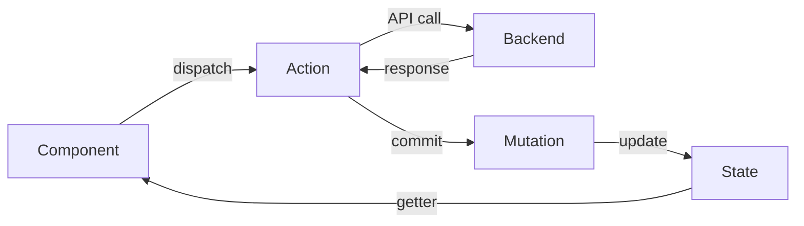

## Overview

Kitsu follows a modern Vue.js architecture with clear separation of concerns. The application uses Vuex for state management, Vue Router for navigation, and a modular API client for backend communication.

## Application Structure

### Entry Point

The application bootstraps in `src/main.js`:

```javascript src/main.js
import { createApp } from 'vue'
import App from '@/App.vue'
import i18n from '@/lib/i18n'
import router from '@/router'
import store from '@/store'

const app = createApp(App)

app.use(i18n)
app.use(router)
app.use(store)

// Sync router with Vuex store
sync(store, router)

// Inject socket.io into store
store.$socket = app.config.globalProperties.$socket

app.mount('#app')
```

Key initializations:
1. Create Vue app instance
2. Install plugins (i18n, router, store, websocket)
3. Sync router state with Vuex
4. Mount to DOM

## Router Architecture

### Route Configuration

Routes are defined in `src/router/routes.js` and follow a hierarchical structure:

```javascript
const routes = [
  {
    path: '/',
    component: MainLayout,
    children: [
      { path: 'productions', component: Productions },
      { path: 'assets', component: Assets },
      { path: 'shots', component: Shots }
    ]
  }
]
```

### Router Setup

The router (`src/router/index.js`) uses:
- **HTML5 History Mode** - Clean URLs without hash
- **Scroll Behavior** - Restores scroll position on navigation
- **Navigation Guards** - Authentication checks

```javascript src/router/index.js
import { createRouter, createWebHistory } from 'vue-router'

const router = createRouter({
  history: createWebHistory(),
  scrollBehavior: loadSavedScrollPosition,
  routes
})
```

## Vuex Store Architecture

### Store Structure

The Vuex store (`src/store/index.js`) uses a modular architecture:

```javascript src/store/index.js
import { createStore } from 'vuex'
import * as getters from '@/store/getters'

// Import modules
import assets from '@/store/modules/assets'
import shots from '@/store/modules/shots'
import tasks from '@/store/modules/tasks'
import people from '@/store/modules/people'
// ... more modules

export default createStore({
  getters,
  modules: {
    assets,
    shots,
    tasks,
    people
    // ...
  },
  strict: false
})
```

### Store Modules

Each module follows a consistent pattern:

<Tabs>
  <Tab title="State">
    ```javascript
    const state = {
      taskMap: new Map(),
      taskComments: {},
      selectedTasks: new Map(),
      isLoading: false
    }
    ```
  </Tab>
  
  <Tab title="Getters">
    ```javascript
    const getters = {
      tasks: state => Array.from(state.taskMap.values()),
      getTask: state => id => state.taskMap.get(id),
      selectedTaskIds: state => Array.from(state.selectedTasks.keys())
    }
    ```
  </Tab>
  
  <Tab title="Actions">
    ```javascript
    const actions = {
      async loadTask({ commit }, taskId) {
        const task = await tasksApi.getTask(taskId)
        commit(LOAD_TASK_END, task)
        return task
      }
    }
    ```
  </Tab>
  
  <Tab title="Mutations">
    ```javascript
    const mutations = {
      [LOAD_TASK_END](state, task) {
        state.taskMap.set(task.id, task)
      },
      [DELETE_TASK_END](state, task) {
        state.taskMap.delete(task.id)
      }
    }
    ```
  </Tab>
</Tabs>

### Key Store Modules

<CardGroup cols={2}>
  <Card title="assets" icon="cube">
    Manages asset entities, types, and asset-related operations
  </Card>
  <Card title="shots" icon="film">
    Handles shot entities, sequences, and episodes
  </Card>
  <Card title="tasks" icon="list-check">
    Task management, comments, and previews
  </Card>
  <Card title="people" icon="users">
    Team members, departments, and assignments
  </Card>
  <Card title="productions" icon="clapperboard">
    Production/project data and settings
  </Card>
  <Card title="files" icon="file">
    File management and output files
  </Card>
  <Card title="user" icon="user">
    Current user state and preferences
  </Card>
  <Card title="login" icon="right-to-bracket">
    Authentication and session management
  </Card>
</CardGroup>

## API Client Architecture

### Base Client

The API client (`src/store/api/client.js`) wraps Superagent:

```javascript src/store/api/client.js
import superagent from 'superagent'

const client = {
  // Promise-based GET
  pget(path) {
    return superagent.get(path).then(res => res?.body)
  },

  // Promise-based POST
  ppost(path, data) {
    return superagent
      .post(path)
      .send(data)
      .then(res => res?.body)
      .catch(err => {
        if (res?.statusCode === 401) {
          errors.backToLogin()
        }
        throw err
      })
  },

  // File upload with progress
  ppostFile(path, formData) {
    const request = superagent.post(path).send(formData)
    return {
      request,
      promise: new Promise((resolve, reject) => {
        request.end((err, res) => {
          if (err) reject(err)
          else resolve(res?.body)
        })
      })
    }
  }
}
```

### API Modules

Each API module (`src/store/api/*.js`) provides domain-specific methods:

```javascript src/store/api/tasks.js
import client from '@/store/api/client'

export default {
  getTask(taskId) {
    return client.pget(`/api/data/tasks/${taskId}/full`)
  },

  updateTask(taskId, data) {
    return client.pput(`/api/data/tasks/${taskId}`, data)
  },

  commentTask(data) {
    return client.ppost(
      `/api/actions/tasks/${data.taskId}/comment`,
      data
    )
  }
}
```

## Component Architecture

### Component Organization

Components are organized by function:

```
components/
├── pages/       # Top-level page components
├── modals/      # Modal dialog components
├── lists/       # List and table components
├── widgets/     # Reusable widget components
├── cells/       # Table cell components
├── layouts/     # Layout components
├── tops/        # Top bar components
├── sides/       # Sidebar components
└── previews/    # Media preview components
```

### Component Patterns

<Tabs>
  <Tab title="Page Component">
    ```vue
    <template>
      <div class="page">
        <top-bar :title="title" />
        <entity-list :entities="assets" />
      </div>
    </template>

    <script>
    import { mapGetters, mapActions } from 'vuex'

    export default {
      computed: {
        ...mapGetters(['assets', 'currentProduction'])
      },
      
      methods: {
        ...mapActions(['loadAssets'])
      },
      
      mounted() {
        this.loadAssets()
      }
    }
    </script>
    ```
  </Tab>
  
  <Tab title="Widget Component">
    ```vue
    <template>
      <div class="widget">
        <slot />
      </div>
    </template>

    <script>
    export default {
      props: {
        data: { type: Object, required: true }
      },
      
      data() {
        return {
          localState: null
        }
      }
    }
    </script>
    ```
  </Tab>
</Tabs>

### Mixins

Reusable component logic is shared through mixins in `src/components/mixins/`:

```javascript
export const taskMixin = {
  methods: {
    formatTaskStatus(task) {
      // Shared logic
    }
  }
}
```

## State Management Patterns

### When to Use Vuex

<Tabs>
  <Tab title="Use Vuex When">
    - State is shared across multiple components
    - State needs to persist across route changes
    - Complex state transformations are required
    - Real-time updates affect multiple views
  </Tab>
  
  <Tab title="Use Local State When">
    - State is only used in one component
    - State is temporary (modal open/close)
    - Performance is critical
    - State is derived from props
  </Tab>
</Tabs>

### Data Flow



## Real-time Updates

Kitsu uses Socket.io for real-time collaboration:

```javascript
// Socket is injected into store
store.$socket.on('task:update', (data) => {
  store.commit(UPDATE_TASK, data)
})

store.$socket.on('comment:new', (data) => {
  store.commit(NEW_COMMENT, data)
})
```

## Internationalization

Kitsu uses Vue I18n for multi-language support:

```javascript src/lib/i18n.js
import { createI18n } from 'vue-i18n'
import en from '@/locales/en'
import de from '@/locales/de'

const i18n = createI18n({
  locale: 'en',
  fallbackLocale: 'en',
  messages: { en, de }
})
```

In components:
```vue
<template>
  <h1>{{ $t('main.title') }}</h1>
</template>
```

## Best Practices

<CardGroup cols={2}>
  <Card title="Keep components focused" icon="target">
    Each component should have a single, clear responsibility
  </Card>
  <Card title="Prefer composition" icon="puzzle-piece">
    Use smaller, composable components over large monolithic ones
  </Card>
  <Card title="Minimize Vuex usage" icon="gauge">
    Use local state when possible for better performance
  </Card>
  <Card title="Use getters for derived state" icon="filter">
    Don't store computed values in state
  </Card>
</CardGroup>

## Next Steps

<Card title="Contributing Guide" icon="code-pull-request" href="/development/contributing">
  Learn how to contribute code to Kitsu
</Card>