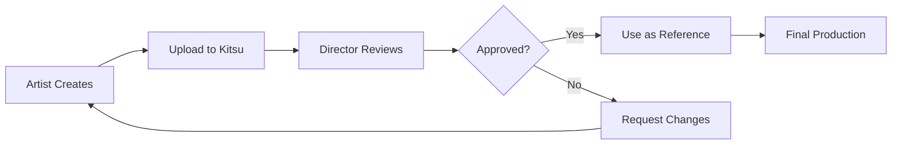

Concepts are early-stage artwork used to explore visual ideas before final production begins. Kitsu helps you organize, review, and approve concept art for characters, environments, props, and other elements.

## What are Concepts?

Concepts represent exploratory artwork and design iterations:

- **Character concepts**: Initial character designs and variations
- **Environment concepts**: Location and set design explorations
- **Prop concepts**: Object and item design studies
- **Color scripts**: Color and mood exploration
- **Visual development**: Overall look and feel studies
- **Storyboard concepts**: Rough visual storytelling explorations

Concepts help teams align on visual direction before committing resources to full production.

## The Concepts Page

The Concepts page displays all concept artwork uploaded to your production, organized by publisher (artist) and status.

### Filtering Concepts

Use the filters to browse concepts:

- **Status**: Filter by task status (Pending, Approved, Retake, etc.)
- **Publisher**: Filter by the artist who uploaded the concept
- **Entity Type**: Filter by what the concept is for (Character, Environment, Prop)
- **Sorted By**: Choose sort order (date, name, status)

## Publishing Concepts

Artists can upload concept artwork for review:

<Steps>
  <Step title="Navigate to Concepts">
    Go to the **Concepts** page from the main navigation
  </Step>
  
  <Step title="Select Entity">
    Click the entity (character, prop, etc.) you're creating concepts for, or upload to the production level for general exploration
  </Step>
  
  <Step title="Upload Artwork">
    Upload your concept files:
    - Supported formats: JPG, PNG, PSD
    - Multiple images can be uploaded at once
    - Each upload creates a new concept entry
  </Step>
  
  <Step title="Add Description">
    Describe your concept:
    - Design intent and variations explored
    - Key features and details
    - Questions for reviewers
  </Step>
  
  <Step title="Publish">
    Click **Publish** to make the concept visible for review
  </Step>
</Steps>

## Reviewing Concepts

Supervisors and directors review concepts to approve or request changes:

<Steps>
  <Step title="Browse Concepts">
    View all published concepts on the Concepts page
  </Step>
  
  <Step title="Open Concept">
    Click a concept thumbnail to view full-size artwork
  </Step>
  
  <Step title="Add Feedback">
    Use comments to provide feedback:
    - Add written notes
    - Use annotations to mark specific areas
    - Request specific changes or variations
  </Step>
  
  <Step title="Change Status">
    Update the concept status:
    - **Approved**: Concept is ready to use as reference
    - **Retake**: Changes are needed
    - **On Hold**: Concept is paused for now
  </Step>
</Steps>

## Concept Properties

Each concept has:

- **Thumbnail**: Preview image
- **Publisher**: Artist who created the concept
- **Entity**: What the concept is for (optional)
- **Status**: Review status (Pending, Approved, Retake)
- **Upload Date**: When the concept was published
- **Preview**: Full-resolution artwork
- **Comments**: Feedback and discussion
- **Attachments**: Additional reference files

## Concept Workflow

Typical workflow for concept art:

<Note>
Concepts are exploratory by nature. Multiple iterations and variations are expected and encouraged.
</Note>

## Best Practices

<AccordionGroup>
  <Accordion title="Upload Early and Often">
    Share work-in-progress concepts:
    - Don't wait for perfection
    - Upload sketches and rough ideas
    - Get feedback early to save time
    - Show multiple variations when exploring options
  </Accordion>
  
  <Accordion title="Clear Descriptions">
    Help reviewers understand your intent:
    - Explain design choices
    - Note what you're trying to solve
    - Highlight areas where you need feedback
    - Reference style guides or inspiration
  </Accordion>
  
  <Accordion title="Iterate Based on Feedback">
    Use feedback effectively:
    - Address all notes in revisions
    - Upload new versions as separate concepts
    - Reference previous versions in comments
    - Ask clarifying questions if feedback is unclear
  </Accordion>
  
  <Accordion title="Organize by Entity">
    Link concepts to specific entities:
    - Associate character concepts with character assets
    - Link environment concepts to set assets
    - Create relationships for easy reference later
    - Use consistent naming across concept variations
  </Accordion>
</AccordionGroup>

## Concept vs. Asset

Understanding the difference:

| Concept | Asset |
|---------|-------|
| Exploratory artwork | Production-ready element |
| Multiple variations | Single approved version |
| Rapid iteration | Formal pipeline |
| Early stage | Later stage |
| Reference/inspiration | Final deliverable |

Concepts are used to explore ideas. Once approved, they become reference for creating production assets.

<Tip>
Pin approved concepts to asset pages so artists can easily reference them while working on modeling, texturing, and other tasks.
</Tip>

## Related Features

<CardGroup cols={2}>
  <Card title="Assets" icon="cube" href="/features/assets">
    Create production assets based on approved concepts
  </Card>
  <Card title="Tasks" icon="check-square" href="/features/tasks">
    Track design and concept tasks
  </Card>
  <Card title="Reviews" icon="eye" href="/tasks/reviews">
    Learn about the review and approval workflow
  </Card>
  <Card title="Playlists" icon="play" href="/features/playlists">
    Create playlists for concept review sessions
  </Card>
</CardGroup>
