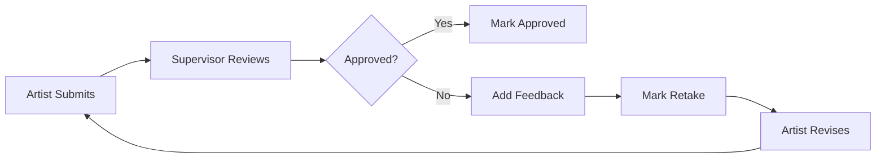

## Overview

As a supervisor, reviewing and approving work is one of your primary responsibilities in Kitsu. The platform provides powerful tools for efficient review, annotation, feedback delivery, and quality control.

## Accessing Tasks for Review

There are several ways to access tasks that need your attention:

### From Task Lists

1. Navigate to **Assets** or **Shots** for your production
2. Find the task type you supervise (e.g., Modeling, Animation)
3. Tasks with status colors indicate their state:
   - **Purple/Blue** - Waiting for your approval
   - **Orange** - Retake in progress
   - **Gray** - Not started

### Using All Tasks View

Go to **All Tasks** from the navigation menu to see:

- All tasks across productions filtered by your permissions
- Tasks assigned to your team
- Ability to filter by production, task type, and status

### Task Filters

Use the search and filter options to find specific work:

- Search by entity name, task type, or assignee
- Filter by task status ("Waiting for Approval")
- Sort by priority, due date, or last comment date
- Save custom searches for frequently used filters

<Tip>
Create a saved search for "Waiting for Approval" tasks in your department to quickly access your review queue each day.
</Tip>

## The Review Interface

When you click on a task, you'll see:

### Task Page Layout

- **Left Panel**: Preview player with submitted work
- **Right Panel**: Comments, task info, and controls
- **Header**: Task type, entity name, status, and assignees

### Preview Player

The preview player allows you to:

- Play video submissions with standard controls (play/pause, scrub, speed)
- View image submissions with zoom and pan
- Navigate between multiple previews using the dropdown
- Compare different versions submitted over time
- View frame-by-frame for detailed review

### Revision Selector

The preview dropdown shows all submitted versions:

- **Latest** at the top (default view)
- Previous revisions numbered sequentially (V1, V2, V3...)
- Submission date and artist name
- Comment count for each revision

Switch between versions to track progress and verify fixes.

## Reviewing Work

### Step-by-Step Review Process

<Steps>
  <Step title="Open the task">
    Click the task from your asset/shot list or review queue
  </Step>
  
  <Step title="Review the latest preview">
    Watch/view the submitted work in the preview player
  </Step>
  
  <Step title="Read artist's comments">
    Understand what they've done and any questions they have
  </Step>
  
  <Step title="Check against references">
    Compare to concept art, previous versions, or style guides
  </Step>
  
  <Step title="Provide feedback">
    Use annotations and comments to communicate your notes
  </Step>
  
  <Step title="Update task status">
    Approve, request retakes, or indicate work in progress
  </Step>
</Steps>

## Adding Annotations

Annotations are powerful visual feedback tools:

### Drawing Tools

1. Click the **Pencil** icon to enter annotation mode
2. Select your drawing color from the palette
3. Adjust line thickness with the size slider
4. Draw directly on the preview image/frame
5. Add arrows, circles, or freehand marks

### Annotation Features

- **Frame-specific**: Annotations are tied to specific frames in videos
- **Color-coded**: Use different colors for different types of notes
- **Persistent**: Annotations are saved and visible to all team members
- **Exportable**: Can be included in reports or screenshots

<Tip>
Use a consistent color scheme for your annotations:
- Red for required changes
- Yellow for suggestions
- Green to highlight what's working well
</Tip>

### Best Practices for Annotations

- **Be clear**: Draw arrows pointing to specific areas
- **Use text sparingly**: Write detailed notes in comments, use drawings to point
- **Don't overdo it**: Too many marks can be confusing
- **Show, don't just tell**: Circle or highlight the exact area of concern

## Providing Feedback Comments

### Writing Effective Feedback

Good feedback is:

**Specific**
```
✗ "The animation doesn't look right"
✓ "The character's weight shift at frame 45 feels too quick. 
   Extend it by 4-5 frames for a more believable transition."
```

**Actionable**
```
✗ "Improve the lighting"
✓ "Add a rim light from camera left to separate the character 
   from the background. Reference shot SH010 for the setup."
```

**Constructive**
```
✗ "This is wrong"
✓ "The proportions are off. Compare to the approved model sheet - 
   the head should be about 1.5x larger relative to the body."
```

**Prioritized**
```
Must fix:
- Correct the hand position (it's passing through the table)
- Fix the lighting pop at frame 89

Nice to have:
- Add subtle camera shake for more dynamism
- Enhance the dust particle effects
```

### Comment Features

- **@Mentions**: Tag artists or other supervisors: @artistname
- **Task references**: Link to related tasks with #task123
- **Time codes**: Reference specific moments: @00:15 for frame/time stamps
- **Checklists**: Add checkboxes for multiple items to address
- **File attachments**: Include reference images or documents

### Frame-Specific Comments

For video reviews:

1. Pause the player on the frame you want to comment on
2. Add your comment
3. The frame number is automatically recorded
4. Artists can click the frame reference to jump directly to it

<Note>
Frame-specific comments make it easy for artists to find exactly what you're referring to in longer sequences.
</Note>

## Updating Task Status

### Status Options

Choose the appropriate status when providing feedback:

#### Approved / Validated
- Work meets quality standards
- No further changes needed
- Task is complete
- Sets status to final/done state

#### Retake / Revision Needed
- Work needs specific changes
- Artist should make corrections and resubmit
- Include clear notes on what to fix
- Task returns to artist's queue

#### Work in Progress (WIP)
- Review is ongoing
- Artist can continue working
- More iterations expected
- Keeps task active

<Warning>
Always include a comment when changing status, especially for retakes. Never just change status without explaining why.
</Warning>

## Approval Workflow

Typical review cycle:



### Quick Approval

For work that's clearly acceptable:

1. Review the preview
2. Add a brief positive comment
3. Set status to **Approved**
4. Submit

**Example comment:**
```
Looks great! The timing and weight are perfect. 
Animation approved.
```

### Requesting Retakes

For work needing changes:

1. Review thoroughly and note all issues
2. Add detailed feedback with annotations
3. Set status to **Retake**
4. Submit

**Example comment:**
```
Good start, but needs some adjustments:

1. The shoulder rotation at frame 23 is breaking - check the rig
2. Add more overlap on the hair secondary animation
3. The foot contact at frame 67 slides - need to fix the contact

Please address these and resubmit. Let me know if you have questions!
```

## Managing Multiple Reviews

### Batch Review Workflow

When reviewing many tasks:

1. **Filter your queue**: Show only "Waiting for Approval" tasks
2. **Sort by priority**: Address urgent work first
3. **Group by type**: Review similar tasks together for consistency
4. **Set time blocks**: Dedicate specific times for reviews
5. **Use keyboard shortcuts**: Alt+arrows to navigate between tasks

### Multi-Selection Actions

For common actions across multiple tasks:

1. Select multiple tasks (Ctrl/Cmd+Click)
2. Use the action panel to:
   - Assign to team members
   - Update status in bulk
   - Set due dates
   - Change priority

<Tip>
Review tasks in batches of similar work (e.g., all modeling tasks, then all animation) to maintain a consistent quality bar.
</Tip>

## Version Comparison

### Tracking Progress

Use the revision selector to:

1. View the latest submission
2. Switch to previous version
3. Compare quality improvements
4. Verify fixes were implemented
5. Track iteration count

### Checking Fixes

When reviewing a retake:

```
Steps:
1. Read your previous feedback
2. Check each note was addressed
3. Verify the fixes are correct
4. Look for any new issues introduced
5. Approve or provide additional notes
```

## Setting as Main Preview

For approved work that should represent the entity:

1. Review and approve the task
2. Click **Set Preview** button
3. This image/frame becomes the entity thumbnail
4. Appears in listings, playlists, and production views

<Note>
Only approved previews should be set as the main preview. This ensures production overviews show approved work.
</Note>

## Advanced Review Features

### Playlists for Review

Create playlists for:

- **Dailies**: Group today's submissions for team review
- **Milestone reviews**: Collect work for client presentations
- **Shot continuity**: Review sequential shots together
- **Department reviews**: All work from a specific team

### Compare Mode

Some installations support split-screen comparison:

- View two versions side-by-side
- Synchronize playback
- Spot subtle differences
- Verify consistency across shots

### Review Statistics

Track your review efficiency:

- Tasks reviewed per day
- Average revision count before approval
- Common rejection reasons
- Fastest turnaround times

## Best Practices

<AccordionGroup>
  <Accordion title="Review Timing">
    - Review work within 24 hours when possible
    - Prioritize blocking issues over polish
    - Set expectations for review turnaround
    - Schedule dedicated review time daily
  </Accordion>
  
  <Accordion title="Feedback Quality">
    - Be specific and actionable
    - Include visual references when helpful
    - Explain the "why" behind requests
    - Balance criticism with positive reinforcement
  </Accordion>
  
  <Accordion title="Consistency">
    - Apply the same quality standards across artists
    - Reference style guides and approved work
    - Document decisions for edge cases
    - Communicate standards clearly to your team
  </Accordion>
  
  <Accordion title="Communication">
    - Encourage questions and discussion
    - Be available for real-time clarification
    - Use video calls for complex feedback
    - Follow up on challenging tasks
  </Accordion>
</AccordionGroup>

## Troubleshooting

### Preview Won't Play

**Issue**: Video preview shows error or won't load

**Solutions**:
- Wait for processing to complete (check upload time)
- Refresh the page
- Check if file format is supported
- Ask artist to re-upload if file is corrupted

### Can't Add Annotations

**Issue**: Drawing tools are disabled

**Solutions**:
- Ensure you're in annotation mode (click pencil icon)
- Check browser compatibility (use latest Chrome/Firefox)
- Verify you have supervisor permissions
- Try on a different browser

### Status Won't Change

**Issue**: Can't update task status

**Solutions**:
- Ensure you have permission for this task type
- Check if task is locked by automation
- Verify you're not in a read-only view
- Contact production manager if issue persists

## Next Steps

<CardGroup cols={2}>
  <Card title="Team Management" icon="users" href="/guides/supervisor/team-management">
    Learn how to assign tasks and manage your team
  </Card>
  
  <Card title="Tracking Progress" icon="chart-line" href="/guides/supervisor/tracking-progress">
    Monitor production progress and deadlines
  </Card>
</CardGroup>