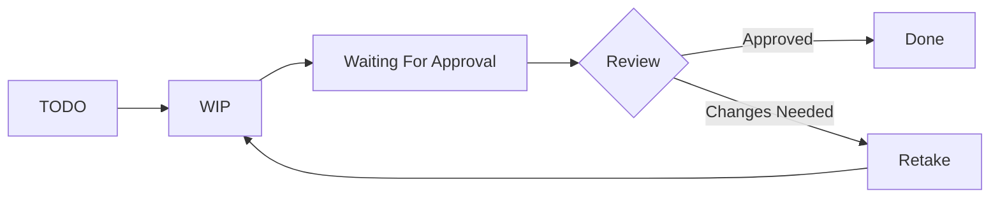

## Overview

Task statuses represent the current state of work on a task. They form the backbone of your approval workflow, tracking progress from initial assignment through to final approval.

## Default Task Statuses

Kitsu provides standard task statuses out of the box:

- **TODO**: Work not yet started (default status)
- **Work In Progress (WIP)**: Artist is actively working
- **Waiting For Approval**: Work submitted for review
- **Retake**: Changes requested
- **Done**: Work approved and complete

<Note>
You can customize these statuses or create new ones to match your studio's workflow.
</Note>

## Creating Custom Statuses

### Adding a New Status

1. Navigate to **Settings** > **Task Status**
2. Click **New task status**
3. Configure the following:

**Basic Information**
- **Name**: Full status name (e.g., "Waiting For Client")
- **Short Name**: Abbreviated version (e.g., "WFC") shown in compact views
- **Description**: Optional details about when to use this status
- **Color**: Visual identifier for quick recognition

**Status Behavior**
- **For Concept**: Whether this status applies to concept art tasks
- **Is Default**: Set as the initial status for new tasks
- **Is WIP**: Mark as an in-progress state
- **Is Done**: Mark as a completed/approved state
- **Is Retake**: Indicates work that needs revision
- **Is Feedback Request**: Status used when requesting review

**Permissions**
- **Is Artist Allowed**: Artists can set tasks to this status
- **Is Client Allowed**: Clients can use this status for approvals

### Status Priority

Task statuses have a priority order that determines:
- Display order in status dropdowns
- Grouping in production views
- Default sorting in task lists

Reorder statuses by dragging them in the status list.

## Status Workflows

### Artist Workflow

Typical artist progression:

1. **Start work**: Change status from TODO to WIP
2. **Submit for review**: Set to "Waiting For Approval"
3. **Receive feedback**: Supervisor sets to either "Done" or "Retake"
4. **Address retakes**: Artist returns to WIP and resubmits

### Supervisor Workflow

Supervisors and managers can:
- View all tasks regardless of status
- Change status during reviews
- Add comments when changing status
- Track retake counts automatically

### Client Workflow

For client-allowed statuses:
- Clients can approve or request changes
- Limited to specific statuses (configured per status)
- Can add review comments
- Automatic notifications to the team

## Status Permissions

### Artist Permissions

When **Is Artist Allowed** is enabled:
- Artists can set their own tasks to this status
- Appears in artist status dropdown
- Used for self-service status updates

Typically enabled for:
- WIP
- Waiting For Approval

Typically disabled for:
- Retake (supervisor-only)
- Done (approval-only)

### Client Permissions

When **Is Client Allowed** is enabled:
- Clients see this status in their review interface
- Used for approval workflows
- Typically limited to approval/rejection statuses

Common client-allowed statuses:
- Approved
- Changes Requested
- Waiting For Revision

## Status Types

### Completion States

**Is Done**
- Marks task as complete
- Updates task end dates
- Triggers downstream task notifications
- Affects production statistics

**Is WIP**
- Indicates active work
- Sets real start date if not already set
- Shows in "in progress" filters
- Affects resource allocation views

**Is Retake**
- Increments retake counter
- Tracks revision iterations
- Affects quality metrics
- Used in retake reports

### Review States

**Is Feedback Request**
- Triggers review notifications
- Moves task to supervisor queue
- Updates last comment date
- Enables approval workflows

## Managing Task Statuses

### Editing Statuses

To modify a status:
1. Click on the status in the library
2. Update fields as needed
3. Click **Confirm**

<Warning>
Changing status behavior (Is Done, Is WIP, etc.) affects existing tasks with that status.
</Warning>

### Archiving Statuses

To archive a status:
1. Ensure no active tasks use this status
2. Click delete on the status row
3. Confirm archival

Archived statuses:
- Don't appear in status dropdowns
- Are preserved on existing tasks
- Can be viewed in the **Archived** tab

### Status for Concepts

Some studios use separate statuses for concept art:
- Enable **For Concept** on relevant statuses
- Concept tasks use these exclusive statuses
- Allows different approval workflows for concept vs production

## Status Indicators

### Visual Representation

In Kitsu interfaces, task status appears as:
- **Colored badges** in list views
- **Status columns** in production tables
- **Color-coded cells** in task grids
- **Progress indicators** in dashboards

### Status Filtering

Filter tasks by status:
- In task type views
- On production boards
- In personal todo lists
- In quota reports

## Automation and Integration

### Status Change Triggers

When a task status changes:
- Comments are automatically created
- Assignees receive notifications
- Time tracking updates (if enabled)
- Production statistics refresh
- Downstream tasks may be affected

### API Integration

Task status changes can be:
- Automated via API
- Triggered from DCC tools
- Integrated with render farms
- Synced with external systems

## Best Practices

<AccordionGroup>
  <Accordion title="Keep status lists concise">
    Too many statuses create confusion. Aim for 5-8 core statuses that cover your essential workflow states.
  </Accordion>
  
  <Accordion title="Use clear, consistent names">
    Status names should be immediately understandable to all team members, including artists, supervisors, and clients.
  </Accordion>
  
  <Accordion title="Set permissions carefully">
    Only allow artists to set statuses that represent their own work states. Reserve approval statuses for supervisors.
  </Accordion>
  
  <Accordion title="Use colors strategically">
    Choose distinct colors for key states. Common pattern: green for done, red for retake, blue for WIP, yellow for pending review.
  </Accordion>
  
  <Accordion title="Test workflows before production">
    Validate status workflows with a small team before rolling out organization-wide.
  </Accordion>
</AccordionGroup>

## Related Resources

<CardGroup cols={2}>
  <Card title="Task Types" icon="layer-group" href="/tasks/task-types">
    Configure task types for your pipeline
  </Card>
  <Card title="Reviews" icon="comment-dots" href="/tasks/reviews">
    Learn about the review and approval process
  </Card>
</CardGroup>